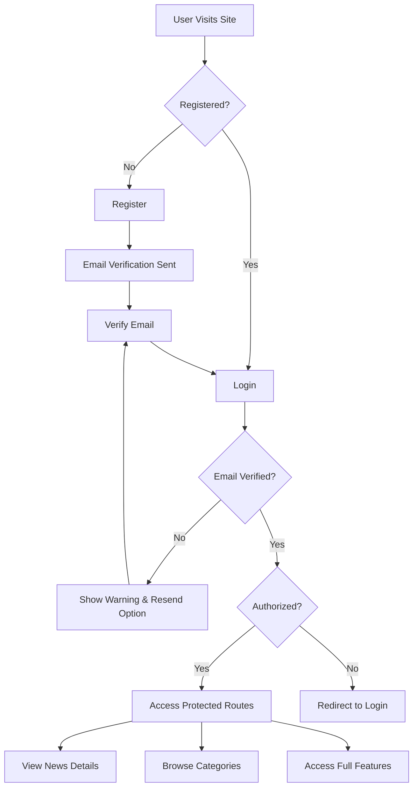

# 📰 The Hide News Online

<div align="center">


### _Stay Informed, Stay Ahead_ 🚀

A modern, feature-rich news platform built with React and Firebase, offering real-time news updates with a seamless user experience.

[](https://projectnewsonline-75378.web.app/)
[](https://github.com/TusharChow20?tab=repositories)
[](https://www.linkedin.com/in/tusharchowdhury20211/)

</div>

---

## ✨ Features

<div align="center">

| 🔐 Authentication | 📱 Responsive Design |    🎨 Modern UI     | 🔔 Real-time Updates |
| :---------------: | :------------------: | :-----------------: | :------------------: |
| **Secure Login**  |   **Mobile-First**   | **Sleek Interface** |  **Live News Feed**  |

</div>

### 🎯 Core Features

- 🔒 **Secure Authentication System**
  - Email/Password registration and login
  - Email verification for enhanced security
  - Google OAuth integration
  - GitHub OAuth integration
  - Password strength validation
  - Private route protection
- 📰 **News Management**
  - Dynamic news categories
  - Latest news section
  - Detailed news view
  - Category-based news filtering
  - News card components
- 📧 **Email Verification**
  - Automatic verification email on registration
  - Resend verification option
  - Login blocked for unverified users
- 🎨 **Beautiful User Interface**
  - Modern, clean design with Tailwind CSS
  - Not Responsive layout for all devices(all feature applied in the large devices)
  - Smooth animations with Lottie
  - Professional alerts with SweetAlert2
  - Left and right navigation sidebars
- 🔔 **Smart Notifications**
  - Real-time error feedback with animations
  - Success messages with custom styling
  - User-friendly error messages
  - Loading states with Lottie animations
- 🛡️ **Enhanced Security**

  - Protected routes with PrivateRoutes
  - Session management
  - Secure Firebase authentication
  - Password validation with regex

- 🏗️ **Multiple Layouts**
  - HomeLayout for main pages
  - AuthLayout for login/register
  - NewsLayout for news details
- 🧭 **Advanced Routing**
  - React Router
  - Protected routes
  - Dynamic category routes
  - News detail routes with parameters

---

## 🛠️ Tech Stack

<div align="center">

### Frontend


### Backend & Database


### Libraries & Tools


</div>

---

## 📦 NPM Packages Used

```json
{
  "dependencies": {
    "@tailwindcss/vite": "^4.1.14",
    "axios": "^1.12.2",
    "date-fns": "^4.1.0",
    "firebase": "^12.4.0",
    "lottie-react": "^2.4.1",
    "lucide-react": "^0.546.0",
    "react": "^19.1.1",
    "react-dom": "^19.1.1",
    "react-fast-marquee": "^1.6.5",
    "react-icons": "^5.5.0",
    "react-router": "^7.9.4",
    "react-router-dom": "^7.9.4",
    "sweetalert2": "^11.26.3",
    "tailwindcss": "^4.1.14"
  },
  "devDependencies": {
    "@eslint/js": "^9.36.0",
    "@types/react": "^19.1.16",
    "@types/react-dom": "^19.1.9",
    "@vitejs/plugin-react": "^5.0.4",
    "daisyui": "^5.3.7",
    "eslint": "^9.36.0",
    "eslint-plugin-react-hooks": "^5.2.0",
    "eslint-plugin-react-refresh": "^0.4.22",
    "globals": "^16.4.0",
    "vite": "^7.1.7"
  }
}
```

---

## 🚀 Getting Started

### Prerequisites

- Node.js (v14 or higher)
- npm or yarn
- Firebase account

### Installation

1. **Clone the repository**

   ```bash
   git clone https://github.com/TusharChow20/projectNewsOnline
   cd the-hide-news-online
   ```

2. **Install dependencies**

   ```bash
   npm install
   ```

3. **Configure Firebase**

   - Create a Firebase project at [Firebase Console](https://console.firebase.google.com/)
   - Enable Authentication (Email/Password, Google, GitHub)
   - Create a `.env` file in the root directory:

   ```env
   VITE_APIKEY=your_api_key
   VITE_AUTHDOMAIN=your_auth_domain
   VITE_PROJECTID=your_project_id
   VITE_STORAGEBUCKET=your_storage_bucket
   VITE_MESSAGINGSENDERID=your_messaging_sender_id
   VITE_APPID=your_app_id
   ```

4. **Run the development server**

   ```bash
   npm run dev
   ```

5. **Build for production**
   ```bash
   npm run build
   ```

---

## 🎨 Project Structure

```
the-hide-news-online/
├── 📦 firebase/
├── 📦 node_modules/
├── 📁 public/
│   ├── categories.json
│   ├── error.json          # Lottie error animation
│   ├── loading.json        # Loading animation
│   └── news.json           # News data
├── 📁 src/
│   ├── 📂 assets/
│   ├── 📂 Components/
│   │   ├── CategoryNews.jsx
│   │   ├── Header.jsx
│   │   ├── LatestNews.jsx
│   │   ├── LeftSideNav.jsx
│   │   ├── Navbar.jsx
│   │   ├── NewsCard.jsx
│   │   └── RightSideNav.jsx
│   ├── 📂 Layout/
│   │   ├── AuthLayout.jsx
│   │   ├── HomeLayout.jsx
│   │   └── NewsLayout.jsx
│   ├── 📂 Pages/
│   │   ├── CategoryNews.jsx
│   │   ├── Login.jsx
│   │   ├── NewsDetails.jsx
│   │   └── Register.jsx
│   ├── 📂 Provider/
│   │   └── AuthProvider.jsx  # Authentication context
│   ├── 📂 Routes/
│   │   └── PrivateRoutes.jsx # Protected routes
│   ├── 📂 FireBase/
│   │   └── firebase.config.js # Firebase configuration
│   ├── App.jsx              # Main app component
│   ├── index.css           # Global styles
│   └── main.jsx            # Entry point
├── .env                     # Environment variables
├── .eslintrc.cjs           # ESLint configuration
├── .firebaserc             # Firebase config
├── .gitignore
├── eslint.config.js
├── firebase.json
├── index.html
├── package.json
├── package-lock.json
├── postcss.config.js
├── README.md
├── tailwind.config.js
└── vite.config.js
```

---

## 🔐 Authentication Flow



---

## 🎯 Key Features Breakdown

### 1. **Registration System**

- ✅ Name validation (minimum 3 characters)
- ✅ Password strength checker
- ✅ Email verification on signup
- ✅ Profile photo URL support
- ✅ Terms & Conditions acceptance
- ✅ Error animations with Lottie
- ✅ SweetAlert notifications

### 2. **Login System**

- ✅ Email verification check
- ✅ Resend verification email option
- ✅ Remember login state
- ✅ Redirect to intended page
- ✅ Social login (Google & GitHub)
- ✅ Forgot password placeholder

### 3. **News Features**

- ✅ Dynamic news categories from JSON
- ✅ Latest news section
- ✅ Category-based news filtering
- ✅ Detailed news view with full article
- ✅ News card components with images
- ✅ Author information display
- ✅ Publication date and time
- ✅ Responsive news grid layout

### 4. **Navigation System**

- ✅ Header with branding
- ✅ Navbar with user profile
- ✅ Left sidebar with categories
- ✅ Right sidebar with additional info
- ✅ Mobile-responsive navigation
- ✅ Protected route navigation

### 5. **Security Features**

- ✅ Password regex validation:
  - Minimum 6 characters
  - At least one uppercase letter
  - At least one lowercase letter
  - At least one number
  - At least one special character (@$!%\*?&)
- ✅ Firebase security rules
- ✅ Private routes with PrivateRoutes component
- ✅ Session management with AuthProvider
- ✅ Automatic logout for unverified users


---

## 🌟 Highlights

- 🎨 **Modern UI/UX** - Clean and intuitive interface
- ⚡ **Fast Performance** - Built with Vite for optimal speed
- 📱 **Fully Responsive** - Works seamlessly on all devices
- 🔒 **Secure Authentication** - Firebase-powered security
- 🎭 **Animated Feedback** - Lottie animations for better UX
- 🔔 **Smart Alerts** - SweetAlert2 for beautiful notifications
- 🚀 **Production Ready** - Deployed and live

---

## 🤝 Connect With Me

<div align="center">

[](https://github.com/TusharChow20)
[](https://www.linkedin.com/in/tusharchowdhury20211/)
</div>


---

## 🙏 Acknowledgments

- Firebase for authentication services
- Lottie for beautiful animations
- SweetAlert2 for elegant alerts
- Tailwind CSS for styling
- React team for the amazing framework

---

<div align="center">

### Made with ❤️ by [Tushar Chowdhury](https://github.com/TusharChow20)

⭐ **Star this repo if you found it helpful!** ⭐


</div>

---

